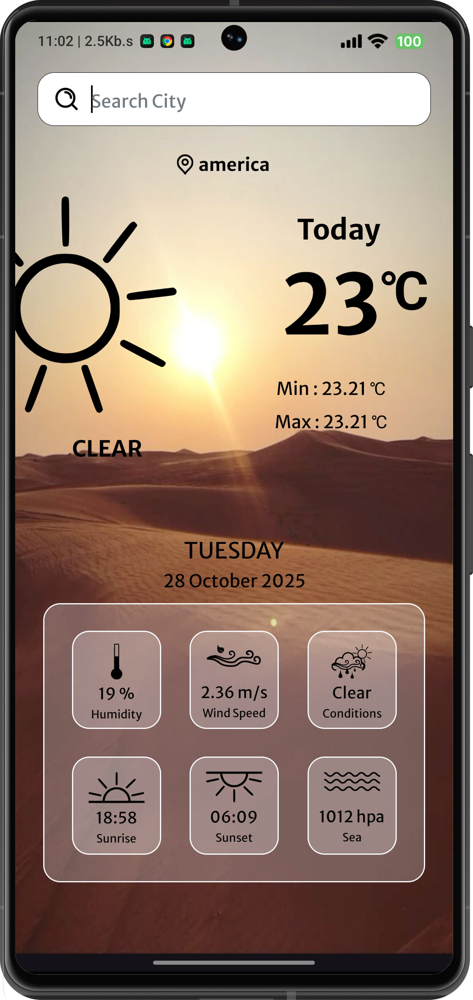
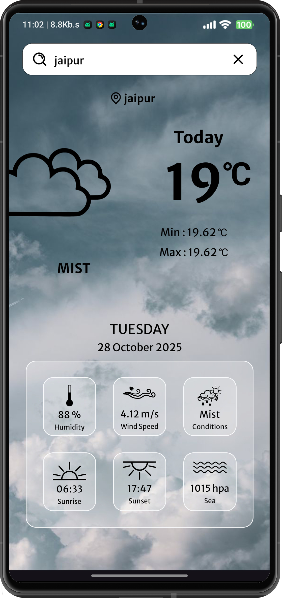

# 🌤️ Weatherly – A Simple Android Weather App 📱

## 📜 Description

Weatherly is a simple Android application that provides real-time weather information. It displays key weather details such as temperature 🌡️, humidity 💧, wind speed 💨, and sunrise/sunset 🌅 times, all powered by the OpenWeatherMap API 🌐.

## ✨ Features and Functionality

*   ⚡ **Real-time Weather Data :** Fetches and displays current weather information for a specified city.
*   🌡️ **Key Weather Metrics :** Shows temperature, minimum/maximum temperatures, humidity, wind speed, sea level pressure, and weather condition.
*   🌅 **Sunrise/Sunset Times :** Presents sunrise and sunset times for the selected location.
*   📍 **Location-Based Data :** Uses city name to retrieve weather data from the OpenWeatherMap API.
*   🎨 **Dynamic Background :** Changes the background and icon based on the weather condition (e.g., ☀️sunny, ☁️cloudy, 🌧️rainy, 🌨️snowy).
*   🔍 **Custom Search View :** Allows users to search for weather information for different cities.
*   🚀 **Splash Screen :** Displays a splash screen on app launch.
*   🖼️ **Edge-to-Edge Display :** Utilizes edge-to-edge display to make full use of the screen.
*   🌓 **Status Bar Theme :** Adapts the status bar icon theme to the current device theme.
*   🚨 **Error Handling :** Displays informative Toast messages for network errors and location fetching failures.

## 📸 Screenshots

<p align="left">
  
  
  
</p>

## 🧰 Technology Stack

*   💻 **Kotlin :** Primary programming language.
*   📱 **Android SDK :** For Android app development.
*   🌐 **Retrofit :** HTTP client library for making network requests to the OpenWeatherMap API.
*   🧩 **Gson :** JSON converter for Retrofit.
*   🪄 **View Binding :** For easy access to views in XML layouts.
*   ☁️ **OpenWeatherMap API :** Provides weather data.

## 📋 Prerequisites

Before running the Weatherly app, ensure you have the following:

*   🛠️ **Android Studio :** Installed and configured on your development machine.
*   🧰 **Android SDK :** Minimum SDK version specified in `build.gradle.kts` (check `minSdk`). Compile SDK Version should be specified in `build.gradle.kts` (check `compileSdk`).
*   🔑 **OpenWeatherMap API Key :** You need to obtain an API key from [OpenWeatherMap](https://openweathermap.org/) and store it in `res/values/strings.xml` under the name `key`.

## ⚙️ Installation Instructions

1.  **Clone the Repository :**

    ```bash
    git clone https://github.com/harshstr14/Weather-App.git
    cd Weather-App
    ```

2.  **Open the Project in Android Studio :**

    *   Launch Android Studio.
    *   Select "Open an Existing Project" and navigate to the cloned `Weather-App` directory.

3.  **Add your OpenWeatherMap API Key :**

    *   Open `app/src/main/res/values/strings.xml`.
    *   Add your API key within the `<resources>` tag:

        ```xml
        <resources>
            <string name="app_name">Weatherly</string>
            <string name="key">YOUR_OPENWEATHERMAP_API_KEY</string>
        </resources>
        ```

4.  **Build and Run :**

    *   Connect an Android device or start an emulator.
    *   Click the "Run" ▶ button in Android Studio to build and run the app.

## 📖 Usage Guide

1.  🚀 **Launch the App :**

    *   The app will display a splash screen first using `MainScreen.kt`
    *   After the splash screen, the main activity `MainActivity.kt` launches, showing the weather for "jaipur" by default.

2.  🔍 **Search for a City :**

    *   Use the `CustomSearchView.kt` to search for a city.
    *   Type the city name in the search bar and press the search icon.
    *   The app will fetch and display the weather data for the searched city.

3.  🌈 **View Weather Details :**

    *   The app will display the temperature, humidity, wind speed, sunrise, sunset and condition of the city searched.
    *   The background and icon will change dynamically based on the condition using the `changeBackground` method in `MainActivity.kt`.

## 🌐 API Documentation

The app uses the OpenWeatherMap API to fetch weather data.

*   **Base URL :** `https://api.openweathermap.org/data/2.5/`
*   **Endpoint :** `weather`
*   **Parameters :**
    *   `q`: City name (e.g., `jaipur`).
    *   `appID`: Your OpenWeatherMap API key (stored in `strings.xml`).
    *   `units`: Units for temperature (e.g., `metric` for Celsius).

The `ApiInterface.kt` defines the API interface using Retrofit:

```kotlin
interface ApiInterface {
    @GET("weather")
    fun getWeatherData(
        @Query("q") city: String,
        @Query("appID") appID: String,
        @Query("units") units: String
    ) : Call<WeatherApp>
}
```

The `WeatherApp` data class and related data classes (`Clouds.kt`, `Coord.kt`, `Main.kt`, `Sys.kt`, `Weather.kt`, `Wind.kt`) define the structure of the JSON response from the API.

## 🤝 Contributing Guidelines

Contributions are welcome! To contribute :

1. 🍴 Fork the repository.
2. 🌿 Create a new branch for your feature or bug fix.
3. ✍️ Make your changes and commit them with descriptive commit messages.
4. ⬆️ Push your changes to your forked repository.
5. 🔀 Submit a pull request to the main repository.

## 📜 License Information

⚠️ No license specified. All rights reserved.

## 📧 Contact/Support Information

For questions or support, please contact: harshstr14@gmail.com
