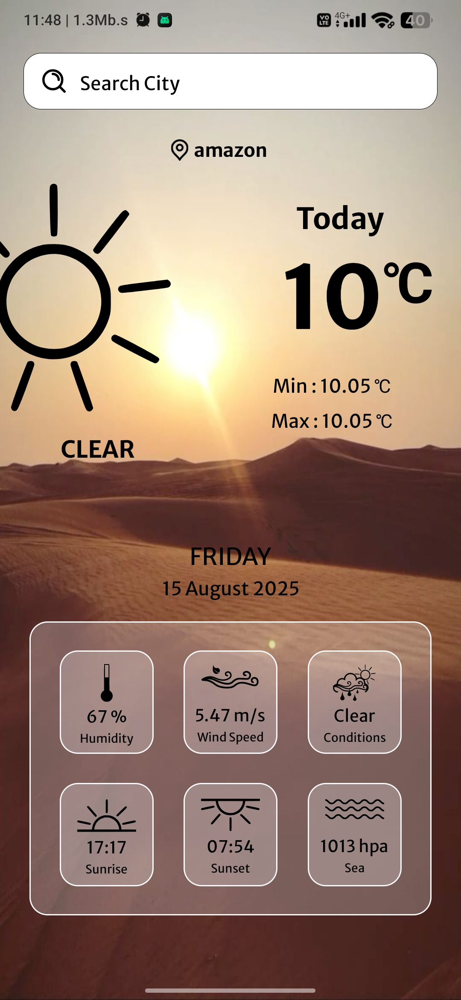
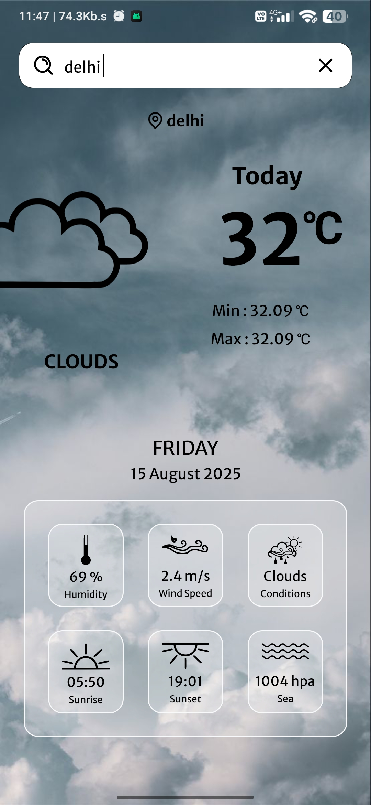

# 🌦️ Weatherly - Android Weather Application

## 📜 Description

Weatherly is a simple Android application that provides current weather information for a specified city. It fetches weather data from the OpenWeatherMap API and displays details such as temperature, humidity, wind speed, sunrise/sunset times, and general weather conditions. The application also features a custom search view that allows users to search for weather information for different cities.

## ✨ Features and Functionality

*   🔍 **City Search:** Allows users to search for weather information by city name using a custom search view.
*   ⏱ **Real-time Weather Data:** Displays current weather information, including temperature, minimum/maximum temperature, humidity, wind speed, and pressure.
*   🌅 **Sunrise/Sunset Times:** Provides sunrise and sunset times for the selected city.
*   ☁ **Weather Conditions:** Displays a description of the current weather conditions (e.g., "Clear", "Clouds", "Rain").
*   🎨 **Dynamic Background:** Changes the background of the app based on the current weather conditions.
*   🚀 **Splash Screen:** A splash screen is displayed on startup for 3 seconds using `MainScreen.kt`.

## 📸 Screenshots  

<p align="left">
  
  
  
</p>

## 🛠 Technology Stack

*   💻 **Kotlin:** The primary programming language for Android development.
*   📱 **Android SDK:** The software development kit for building Android applications.
*   🌐 **Retrofit:** A type-safe HTTP client for Android and Java. Used to make API requests to OpenWeatherMap.
*   📦 **Gson:** A Java serialization/deserialization library to convert JSON into Kotlin objects.
*   🖇 **View Binding:** Generates binding class for each XML layout file present in that module and allows you to more easily write code that interacts with views.
*   ☁ **OpenWeatherMap API:** A weather data API used to retrieve weather information.

## 📋 Prerequisites

Before running the application, ensure you have the following installed:

*   🏗 **Android Studio:** The official Integrated Development Environment (IDE) for Android development.
*   📱 **Android SDK:** The Android Software Development Kit, which provides the tools and libraries necessary for building Android applications.
*   ⚙ **Gradle:** The build automation system used by Android Studio.

## 📥 Installation Instructions

1.  **Clone the repository:**

    ```bash
    git clone https://github.com/harshstr14/Weather-App.git
    ```

2.  **Open the project in Android Studio:**

    *   Launch Android Studio.
    *   Select "Open an Existing Project" and navigate to the cloned repository directory.

3.  **Build the project:**

    *   In Android Studio, go to "Build" -> "Make Project" or "Build" -> "Rebuild Project".

4.  **Run the application:**

    *   Connect an Android device or start an Android emulator.
    *   Click the "Run" ▶ button in Android Studio or go to "Run" -> "Run 'app'".

## 📖 Usage Guide

1.  **Launching the application:**

    *   After installation, the application will be available on your Android device or emulator.

2.  **Searching for a city:**

    *   Use the custom search view at the top of the screen to enter a city name.
    *   Press the "Search" or "Enter" key on the keyboard.
    *   The application will display weather information for the specified city.

## 📡 API Documentation

The application uses the OpenWeatherMap API to fetch weather data.

**API Endpoint:** `https://api.openweathermap.org/data/2.5/weather`

**Parameters:**

*   `q`: City name (e.g., `jaipur`).
*   `appID`: Your OpenWeatherMap API key. The application uses `4e80ec179dc79ae2f18c4df636089253`. Consider replacing this with your own API key for production use.  You can obtain one at [https://openweathermap.org/api](https://openweathermap.org/api).
*   `units`: Units of measurement (e.g., `metric` for Celsius).

**Example API Request:**

```
https://api.openweathermap.org/data/2.5/weather?q=jaipur&appID=4e80ec179dc79ae2f18c4df636089253&units=metric
```

**Kotlin Implementation:**

The `ApiInterface.kt` file defines the Retrofit interface for accessing the API:

```kotlin
package com.example.weatherly

import retrofit2.Call
import retrofit2.http.GET
import retrofit2.http.Query

interface ApiInterface {
    @GET("weather")
    fun getWeatherData(
        @Query("q") city: String,
        @Query("appID") appID: String,
        @Query("units") units: String
    ) : Call<WeatherApp>
}
```

## 🤝 Contributing Guidelines

Contributions to the Weatherly project are welcome! To contribute:

1.  Fork the repository.
2.  Create a new branch for your feature or bug fix.
3.  Make your changes and commit them with descriptive commit messages.
4.  Submit a pull request to the `master` branch.

## 📜 License Information

This project does not specify a license.  All rights reserved.

## 📬 Contact/Support Information

For questions or support, please contact harshstr14 through GitHub.
